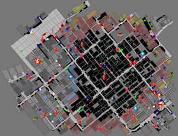
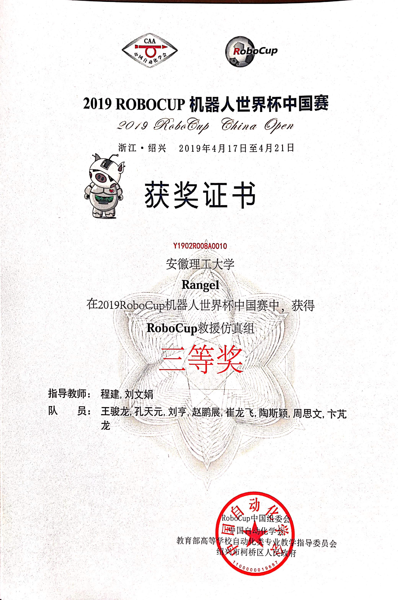
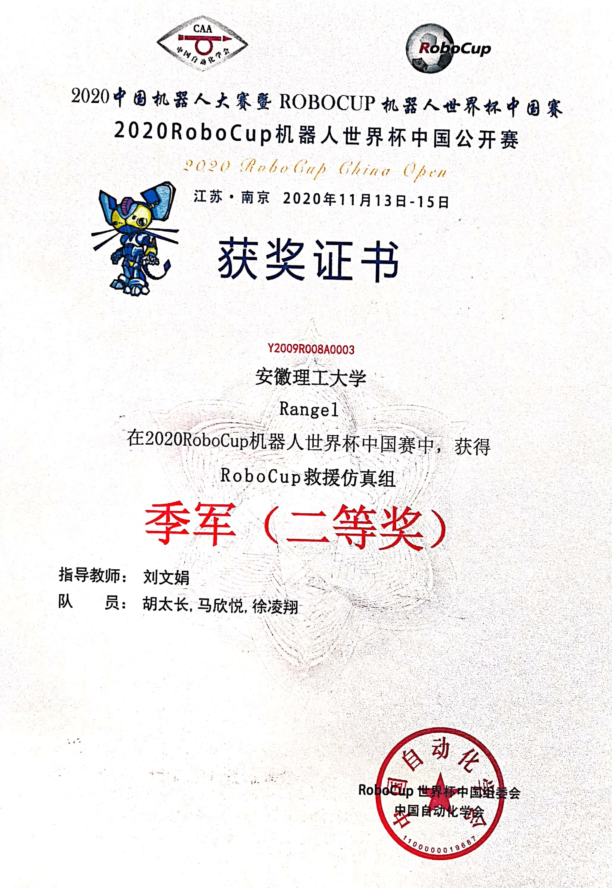
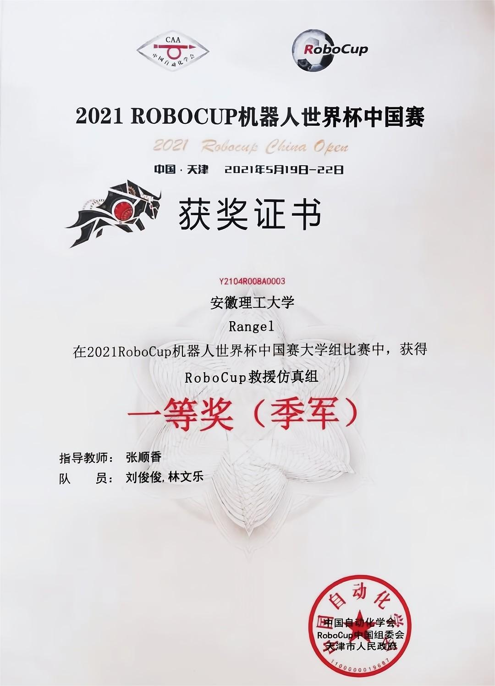
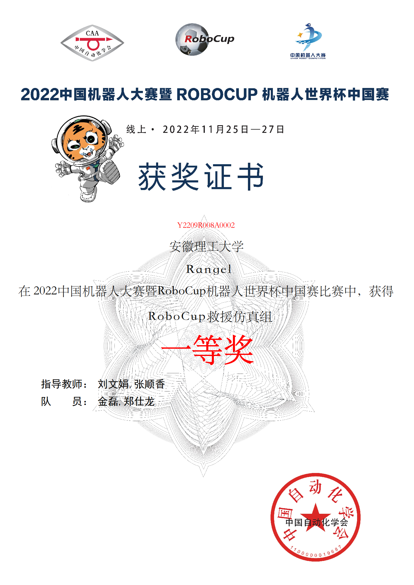

# 历史

自然灾害是造成大规模经济、人类和环境损失的重大不利事件。它们通常很难预测，防止它们发生更具挑战性。这些特点要求制定灾害管理战略，以在灾害发生时减轻破坏性后果。

Robocup Rescue Simulation是一个教育和研究项目，旨在应对1995年1月17日发生在日本兵库县的阪神大地震这一具体自然灾害，该地震造成6000多人死亡，其中大部分发生在神户市。机器人杯救援模拟联盟的使命是促进具有社会意义的自然灾害领域的研究和开发。有效执行这项任务可转化为三个主要目标：

1. 提供一个能够真实地表示自然灾害情景的模拟器，在那里可以评估应对计划。
2. 提供一个能够真实地表示自然灾害情景的模拟器，在那里可以评估应对计划。
3. 通过组织竞赛促进研究和开发，以促进研究人员和从业者之间的思想和经验交流。这些目标旨在帮助制定更复杂和正式的计划，以有效应对自然灾害并减少对社会的负面影响。

机器人杯救援项目最早的目的是将机器人杯足球的技术应用于救灾和救生。该项目于2001年启动，包括真实机器人和模拟联盟。

Aegnt比赛的救灾问题很复杂，但是加入Agent比赛的社区很容易，因为委员会提供了一个方便的软件框架，我们称之为代理开发框架（ADF）。

由于ADF提供了一个结构良好的软件体系结构，参赛者可以只专注于自己感兴趣的问题，即使救灾问题是一个更复杂的问题。

# 简介

Agent Simulation比赛主要评估Agent团队在RoboCup救援Agent Simulation（RCRS）平台不同地图上的表现，RCRS是一个用于灾难响应管理研究的综合模拟环境。。具体来说，这项比赛包括评估救护车、警察部队和消防队特工在刚刚发生地震的城市中营救平民和灭火的有效性。本次比赛由预赛、半决赛和决赛组成。每一轮都由一组地图组成，这些地图代表了不同的可能情况，用于在每一轮中评估和评分每个代理团队。每一轮都会给每一支队伍分配一个综合分数。

在灾难后的救援行动中，合作是必不可少的。一般来说，这个问题不是单个Agent可以解决的，需要一个动态组合各个功能以解决任务的异构团队。这一要求是由于灾区的结构多样性、传感器可以感知的各种证据以及快速可靠地检查大区域的必要性。然而，联合救援队的表现取决于组合正确的能力组合，并且必须作为一个整体进行设计。

一些灾难模拟器和一些Agent模拟器在救灾模拟中运行。有火灾、坍塌和堵塞模拟器作为灾难模拟器。有消防队、救护队、警察部队和平民作为Agent模拟器。参赛者需要开发消防队、救护队和警察部队的策略，即算法。其他模拟器由RoboCup救援模拟项目提供。

机器人杯救援模拟联盟的委员会为比赛准备了一些场景。比赛分为初赛和决赛。在每一轮比赛中，给出大约8个场景。该场景表示救灾模拟的以下条件。

- 灾区
- 每种类型的Agent的数量
- 初始点火点的位置、建筑物倒塌、道路堵塞
- Agent之间通信的可用性

换句话说，参与者需要开发适合每种场景的算法。

尽管Agent的开发很复杂，但大多数代码都是从RoboCup救援技术委员会的Agent开发框架中提供的。因此，参与者可以集中精力开发自己的算法。

在比赛中，参赛者争夺对Agent策略的掌握。表现最好的队伍可以获得最高分数。得分是根据每个场景中Agent的行为计算得出的。因此，使用分数的总和来决定获胜者。

# 目标

本次比赛的目标是应对这一技术和科学挑战，并通过规划、学习和信息交换能力扩展当前的救援策略，以协调他们的努力并作为一个团队完成救援任务。更具体地说，比赛旨在：

1. 揭示救灾问题的结构；
2. 从救灾问题中化解隐藏的问题并加以解决；
3. 开发和存储一些算法和程序代码；
4. 用我们的成果为现实世界做出贡献。

# 我们的荣誉

- 2019年

  

- 2020年

  

- 2021年

  

- 2022年

  

- 未来

  more...

# 参赛要求

- Java
- 数据结构
- 算法

# 联系方式

